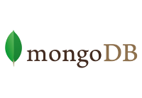

# Are You Ready for Bitesize?

<b>The following is a checklist for development teams looking to move to the Bitesize platform. </b> 
  - [ ] Service dependencies must be externally accessible and secure internet addressable endpoints. 
  - [ ] Bitesize does not permit private VPN based integration for access to other endpoints (ex. with another Pearson Application). 
  - [ ] There are no limitations regarding licensing or support of COTS/3rd party software that would prohibit containerization. This does not preclude a move to Bitesize but will be an important consideration. 
  - [ ] All applications and data stores have authentication and restricted access. 
  - [ ] Upstream clients are capable of using SNI (there are workarounds if not). 
  - [ ] Application will ideally conform to [12 Factor App](https://12factor.net/) and preferably [Micro Services Oriented Architecture](https://smartbear.com/learn/api-design/what-are-microservices/) 
  - [ ] Codebase resides in a Git repo (can adjust for others but this is currently supported through the CI/CD pipeline). 
  - [ ] Application(s) do not need any persistent data stores outside the list below. 
    - [ ] Application(s) has persistent data store requirements not listed below. 
  - [ ] Application(s) can run on 2GB of RAM and 1CPU or less (horizontally scale to meet demand). 
  - [ ] Application(s) can reconnect to downstream dependencies without a restart. (ex. databases) 
  - [ ] QA Automation is key to a successful CD pipeline. We will or already have said automation. 
  - [ ] Applications(s) can run without root privileges.  
  - [ ] Application(s) do or will conform to environment variable based configuration (i.e. no static files for configuration of databases, usernames, passwords etc etc).  
  - [ ] The application(s) can or will log to stdout (best practice for containers).  
  - [ ] Application(s) will work with one or more of the base images currently provided. 
    - [ ] Application(s) will need assistance creating a base image that doesn't currently exist.   

### Stateful Applications
The Bitesize team differentiates between containers (aka pods) and stateful services that require persistent storage. Containers can be built into your CI pipeline with little or no help from the Bitesize team. Stateful services are virtual machines we automatically deploy and provide access to your application(s) through dynamic config. Addition of New stateful services require automation and thus we rely on a request to the Bitesize team.

<b>Persistent data stores current supported:</b> 
 
 
<!--  
#  
 
   -->
  

### Considerations and Questions you may want to think about
In an ideal world your application will be architected as 12-factor app and/or micro service.  We recognize this is a target state for many teams. The following questions may assist in helping you to realize the complexities involved in getting there. We implore you take some time and work through the following questions. It will help significantly with your migration to Bitesize. 

Speak to colleagues who have already onboarded an application using the same language base.  We have prioritized backlog based on their build methods. Part of the process of moving to Bitesize is about getting a developer community to self-align around a preferred method per language to standardize, optimize and simplify our delivery automation.  
Current Apps include: 
Pulse 
Reader+ 
Console 
Registrar 
 
 

How do you build your apps? <i>Bitesize CD pipeline currently assumes a .deb artifact is created</i>   

Please provide programming language(s) used by your application?  

What are the databases? Mongo / Cassandra / MySQL?  

Do you need help migrating existing databases?  

Are there any other stateful requirements (Elastic Search, NFS, Couch etc…?)  

What dependent applications services do you have? (ex. Pi)   

Are there other applications who access your app that are not through a public endpoint?  

Are there applications your application(s) access that are not through a public endpoint?  
  Are those dependent applications within AWS, Private Data Center or External?  

## Next Steps
Consider reading up about important [Bitesize Platform Concepts](http://kubecon.dev-bite.io//platform-concepts/readme.html) 
or 
Begin having a look at our [CI/CD Pipelin](http://kubecon.dev-bite.io/deployment-pipeline/working-with-jenkins.html)
