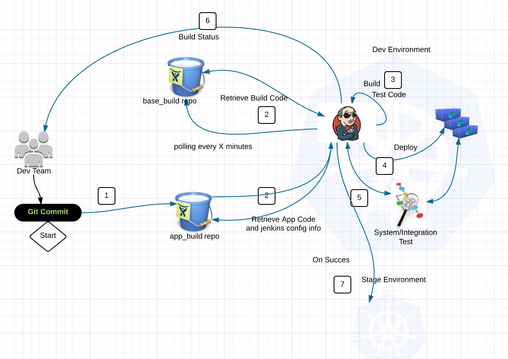

# Platform Concepts

In Bitesize there are many design concepts that are quite different from traditional Pearson workloads.
For each of the concepts below we'll give an overview of how they work in the context of Bitesize.

Include:
  * [Load Balancing](#LoadBalancing)
  * [Build Pipelines](#BuildPipelines)
  * [Logging](#Logging)
  * [Datastores](#Datastores)
  * [SSL](#SSL)

<br>
<br>
<a id="LoadBalancing"></a>
**Load Balancing**

There are two different types of load balancing in Kubernetes. I’m going to label them internal and external.

Internal –
aka “kubernetes service” is load balancing across containers of the same type using a label. These services generally expose an internal cluster ip and port(s) that can be referenced as an environment variable to each pod.


External –

Ingress and Ingress Controllers. This in my mind is the future of external load balancing in Kubernetes.

Ingress – Collection of rules to reach cluster services.

Ingress Controller – HAproxy, Vulcan, Nginx pod that listens to the /ingresses endpoint to update itself and acts as a load balancer for Ingresses. It also listens on its assigned port for external requests.


In the diagram above we have an Ingress Controller listening on :443 consisting of an nginx pod. This pod looks at the kubernetes master for newly created Ingresses. It then parses each Ingress and creates a backend for each ingress in nginx.

```
Nginx –> Ingress –> Service –> application pod.
```

With this combination we get the benefits of a full fledged load balancer, listening on ports for traffic that is fully automated.

In Bitesize we abstract this further by providing external Load Balancing as a part of our build pipeline.

```
services:
  - name: docs-app
    external_url: demo.dev-bite.io
    port: 80 # this is the port number the application responds on in each container/instance/pod
```

With this our development teams no longer need to be concerned with Load Balancing their app. The Bitesize team provides a scalable, fault tolerant, performant solution.

<br><br>

<a id="BuildPipelines"></a>
**Build Pipelines**

A common set of configuration files are used to build, deploy and manage applications in the PaaS. A custom plugin based on Jenkins was written to provide this capability. All build pipelines on Bitesize utilize this feature as it provides standard functionality around governance, automation, security and availability that simply can't be guaranteed elsewhere.

More can be found on our [Deployment Pipeline](http://kubecon.dev-bite.io//deployment-pipeline/readme.html)



You will notice there is an immense amount of flexibility provided including having separate repositories for various testing constructs, deployment into multiple environments and the ability to install things through various package managers.

Why Jenkins? Because the vast majority of Pearson uses Jenkins and thus it provides a familiar interface.


<br><br>
<a id="Logging"></a>
**Logging**

Bitesize has two logging capabilities available.

  * [Grafana/ElasticSearch](../working-with-grafana.html)
    * A log aggregation solution for near real-time log events built for Multi tenancy.
  * [Kafka](../working-with-kafka.html)
    * Robust, scalable logging solution backed up to S3/Glacier. Most often used for Dev teams requiring a log event feed to their own log aggregation solution.

<br>

<a id="Datastores"></a>
**Datastores**

Persistent Datastores are currently built as VM clusters through automation triggered through the deployment pipeline.

Example:
```
services:
   - type: mysql  # mysql or mongo currently
     name: db     # unique name (within environment namespace) of your service
     version: 5.6 # resource version -- e.g. 5.6 for MySQL 5.6
```

Below it gives an idea of what happens in the background.

More information on how to implement can be found at [deployment pipelines](../deployment-pipeline/working-with-jenkins.html).


<br>

<a id="SSL"></a>
**SSL**

Our load balancing service can automatically pull in ssl certs based on the Ingress specified from Vault. Making updates simple and seamless without taking downtime.

Caveat: SNI is required for all endpoints.


<!--
<a id="SecretsManagement"></a>
**Secrets Management**


<a id="ServiceDiscovery"></a>
**Service Discovery**

<a id="DynamicConfiguration"></a>
**Dynamic Configuration**-->
