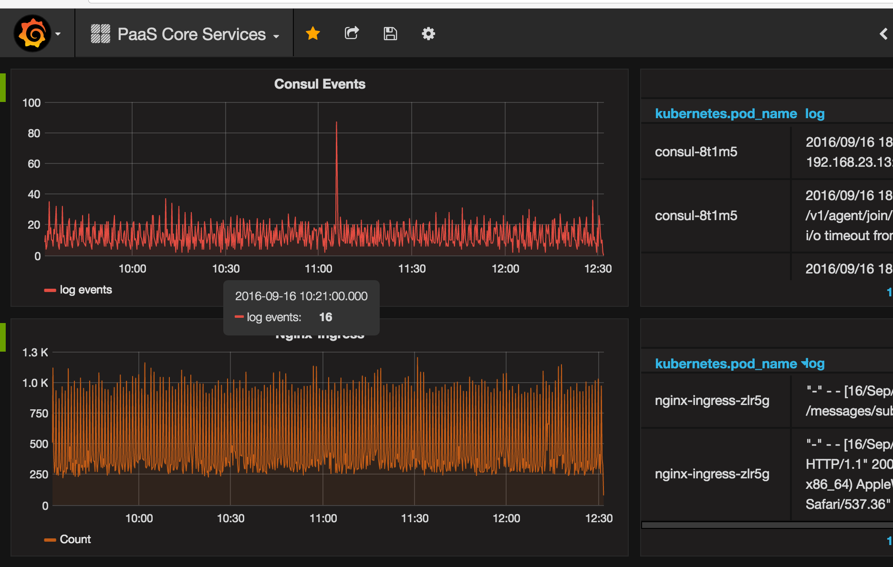
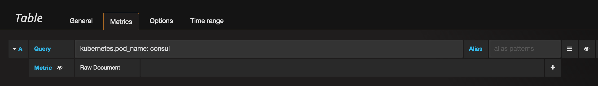
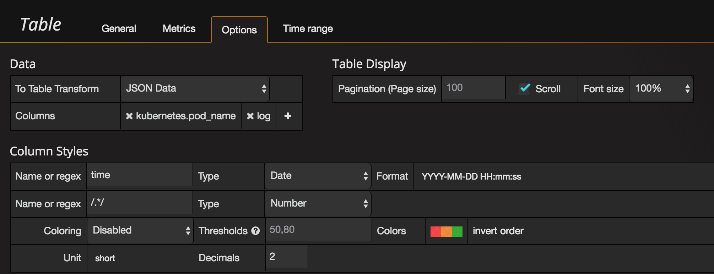

## Grafana - [grafana.prsn.io](https://grafana.prsn.io)
========================================================================================

 

##### Why grafana? 
We chose Grafana because its a fast, reliable, flexible solution that can meet the requirements of PaaS regardless of what direction we take in the future.

Currently we use Grafana as a log monitoring solution for Bitesize. It allows our customers to utilize the provided ElasticSearch backend to consume and view their logs through a readily available interface.  

##### Requirements

   * Grafana acct - obtain by submitting a COPS request to the Operations team. (https://mycloud.atlassian.net/projects/COPS) 
   * VPN - You need to be on the network.  

URL: https://grafana.prsn.io 

If you find yourself hitting a "CERT AUTHORITY INVALID" error, make sure you have the Pearson Root CA installed on your local work environment. This can be accomplished by pulling it from Self-Service.
  

##### Getting Started

[Grafana Intro](https://www.youtube.com/watch?v=sKNZMtoSHN4&index=7&list=PLDGkOdUX1Ujo3wHw9-z5Vo12YLqXRjzg2) 

[Basic Concepts](http://docs.grafana.org/guides/basic_concepts/) 

[Using Grafana with an ElasticSearch backend](http://docs.grafana.org/datasources/elasticsearch/) 

##### To view log events in Grafana

Create a Table 

notice "kubernetes.pod_name:" 
This is one method that allows you to narrow down which applications you wish to see logs for.  

Now lets look at the Options Tab: 
Look in particular at the "column" row and select which metrics you want to be visible.
In this example we have "kubernetes.pod_name" and "log". 
And look at the "Column Styles" - We use "time" instead of @timestamp which is often the default.

